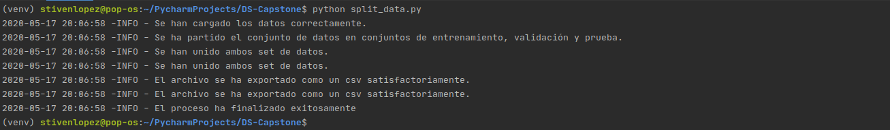
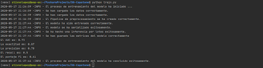
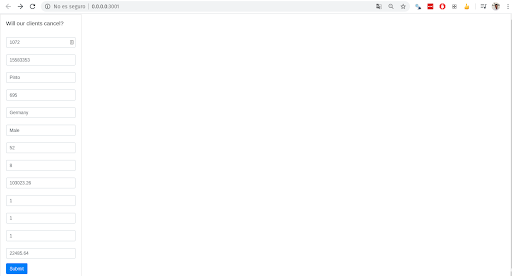

# DS-Capstone

## Capstone Project

## Motivation

Predicting which users will leave the company is important for a company because they can react quickly to dissuade the user from leaving, since for each company users are a very important asset. This project seeks to solve a case like the one mentioned.

## Instructions:

1. First a partition of the data set will be made into training and test data, for this run the following command:
    `python split_data.py`

The above code produces these results in terminal:

2. The model is trained and serialized, in addition the performance in the test data is evaluated and these metrics are saved, to do this run the following command:
    `python train.py`
    
The above code produces these results in terminal:

    
3. Finally the web page is run to make an inference online, the following command does the above:
    `python run.py`
    
The above code produces these results in terminal:

The website looks as follows:

And when making the inference this is the result:

## Metrics

The model had the following performance on unobserved data (test):

* AUC: 0.73

* Accuracy: 0.87

* Precision: 0.78

* Recall: 0.5

* F1 Score: 0.61

## To improve:

* Use other hyperparameter search methods such as Bayesian search.

* Improve the appearance of the web page, since it is very simple but functional at the moment.

* Experiment with other algorithms in order to obtain better results.

